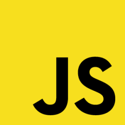
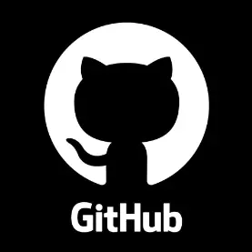
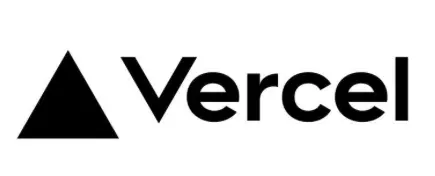

# Tech Stack

#### Languages

  
  
  

#### Frameworks and Libraries

  
  
  
  

#### CI/CD and PaaS

  
  
  
  

# Career

- EZEN Academy Student (React, Node.js) 2021.09.27 ~ 2022.03.25
- Namu Labs Frontend Developer 2022.04.07 ~ 2022.08.31

    

